# PlacementIQ — Student Career Success Analysis

## Problem Statement

Identifying the key drivers of student placement success using academic, skill, and experience data to enable data-driven career decision-making.

---

## Dataset Description

The dataset contains **50,000 student records** covering:

| Category | Columns |
|---|---|
| **Academic** | CGPA, Attendance_Percentage, Study_Hours_Per_Week, Academic_Performance |
| **Technical Skills** | Programming_Skill, Projects_Completed, Certifications, Hackathons |
| **Professional Experience** | Internships, Leadership_Experience, GitHub_Profile, LinkedIn_Profile |
| **Soft Skills** | Communication_Skills, Teamwork, Problem_Solving, English_Proficiency |
| **Placement Outcomes** | Placement_Status, Company_Tier, Career_Field, Placement_Mode, Starting_Salary_USD |

**File:** `student_career_success_dataset_cleaned.csv`  
**Rows:** 50,000 | **Columns:** 29

---

## Project File Structure

```
PlacementIQ/
│
├── student_career_success_dataset_cleaned.csv   # Source dataset
│
├── main.py                                      # Single file — analysis pipeline + Streamlit dashboard
│
├── requirements.txt                             # All Python dependencies (pinned versions)
├── README.md                                    # This file
│
├── Project_Documentation.docx                  # Formal project report
│
└── charts/                                      # PNG charts generated by main.py
    ├── placement_by_major.png
    ├── placement_by_year.png
    ├── cgpa_placed_vs_not.png
    ├── emp_score_placed_vs_not.png
    ├── salary_by_tier.png
    ├── placement_by_internships.png
    ├── placement_by_github.png
    ├── placement_status_pie.png
    ├── placement_mode_pie.png
    ├── cgpa_boxplot.png
    ├── emp_score_boxplot.png
    └── correlation_heatmap.png
```

---

## Setup Instructions

### 1. Install Dependencies

```bash
pip install -r requirements.txt
```

### 2. Run the Analysis Script

Runs all 6 steps — cleaning, metrics, summaries, and saves chart images to the `charts/` folder.

```bash
python main.py
```

### 3. Launch the Streamlit Dashboard

```bash
python -m streamlit run main.py
```

The dashboard will open at `http://localhost:8501` in your browser.

---

## Key Findings

### Overall Placement Rate
- **78.08%** of students were successfully placed.

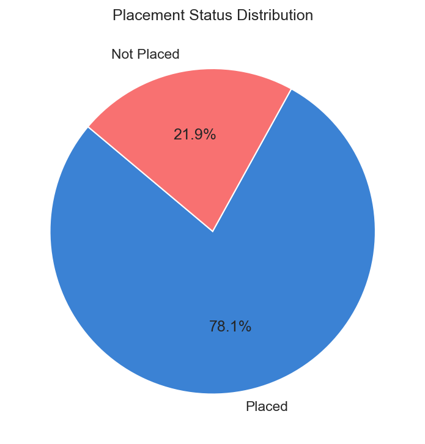

---

### Placement Rate by Major

| Major | Placement Rate |
|---|---|
| Artificial Intelligence | **86.62%** (highest) |
| Software Engineering | 86.22% |
| Business Analytics | **59.05%** (lowest) |
| Electrical Engineering | 60.20% |

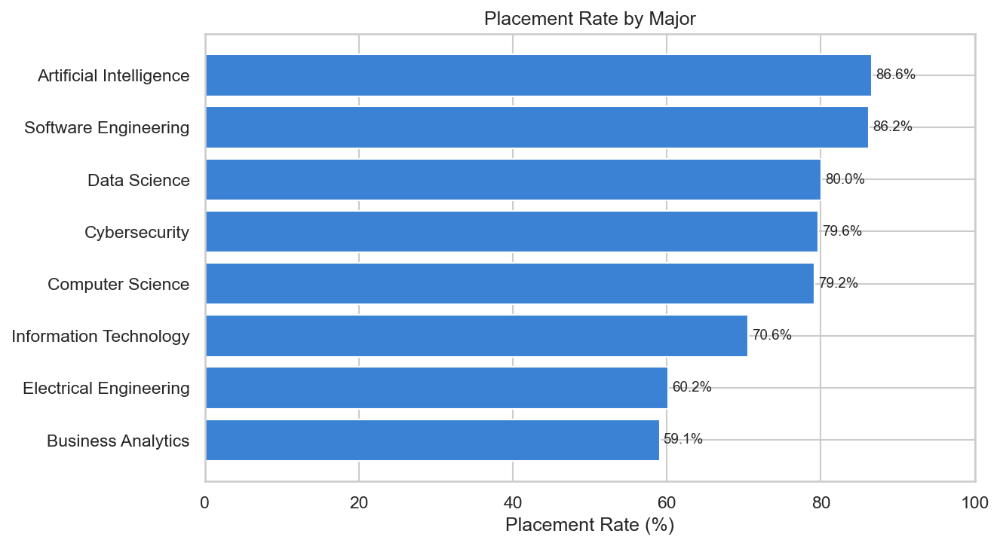

---

### Placement Rate by University Year

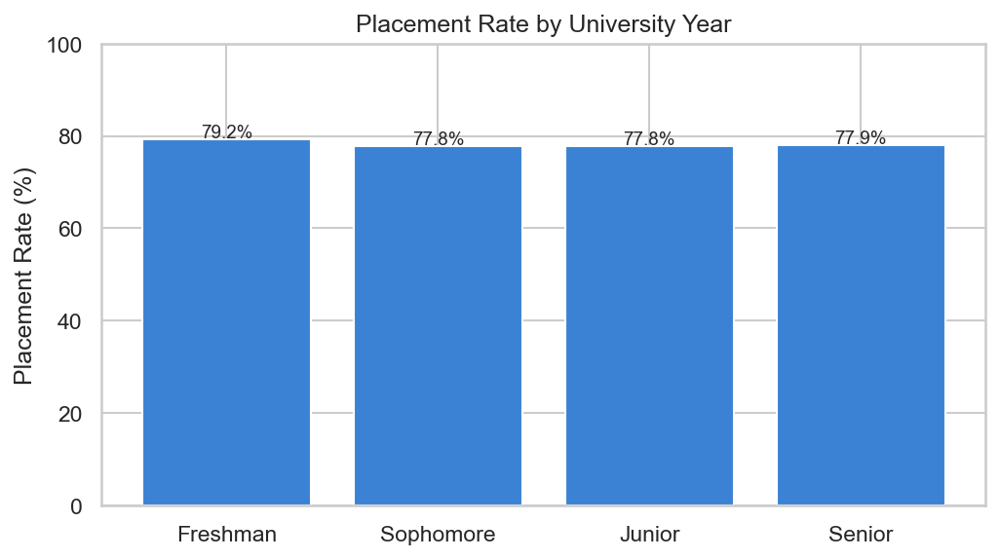

---

### Academic Performance Comparison

| Group | Avg CGPA | Avg Employability Score |
|---|---|---|
| Placed | **3.15** | **220.71** |
| Not Placed | 2.96 | 190.06 |

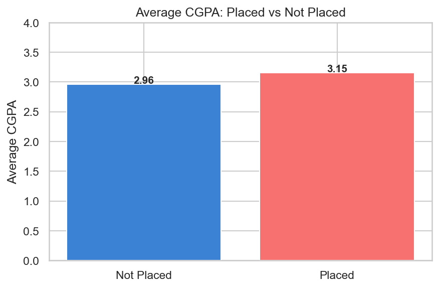

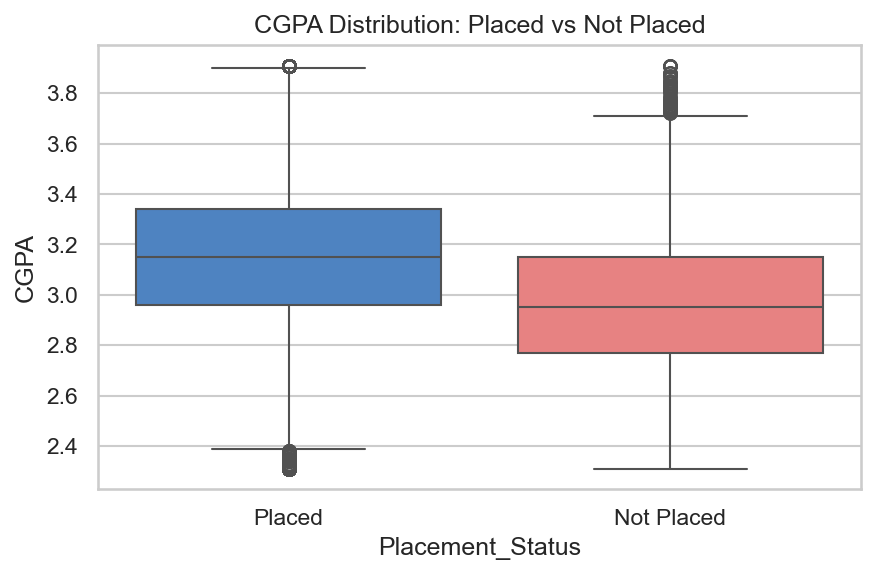

---

### Salary by Company Tier

| Tier | Avg Starting Salary |
|---|---|
| Tier 1 | **$90,011** |
| Tier 2 | $57,500 |
| Tier 3 | $46,958 |

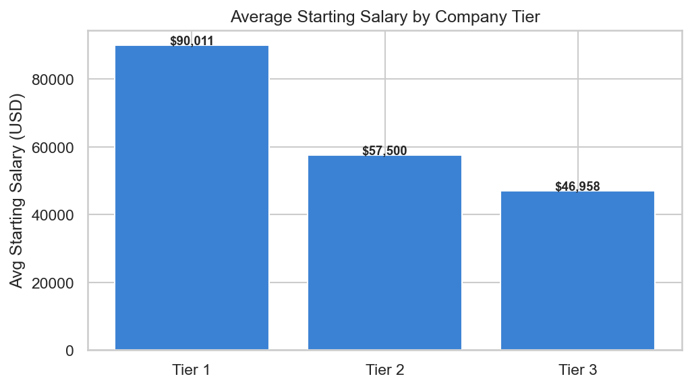

---

### Impact of Internships

| Internships | Placement Rate |
|---|---|
| 0 | 6.78% |
| 2 | 40.73% |
| 5 | **91.87%** |

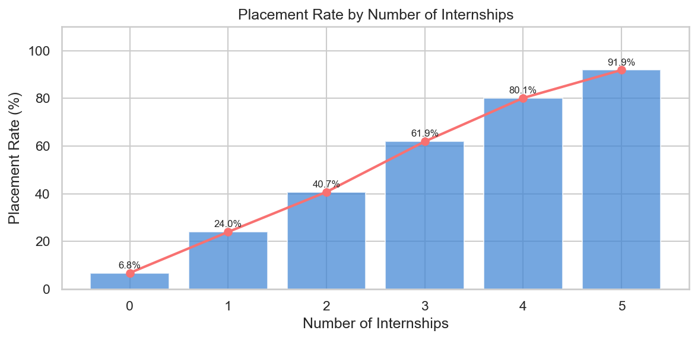

---

### GitHub Profile Impact

- Students **with** a GitHub profile: **80.13%** placement rate  
- Students **without** a GitHub profile: **69.14%** placement rate

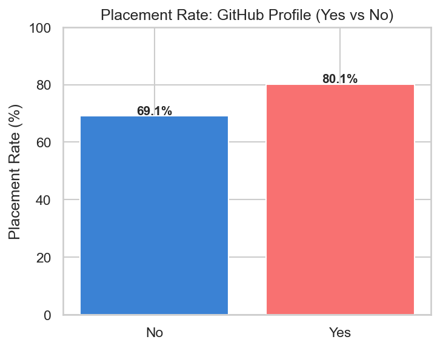

---

### Placement Mode Distribution

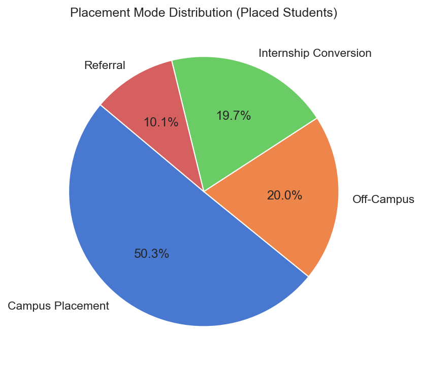

---

### Employability Score Comparison

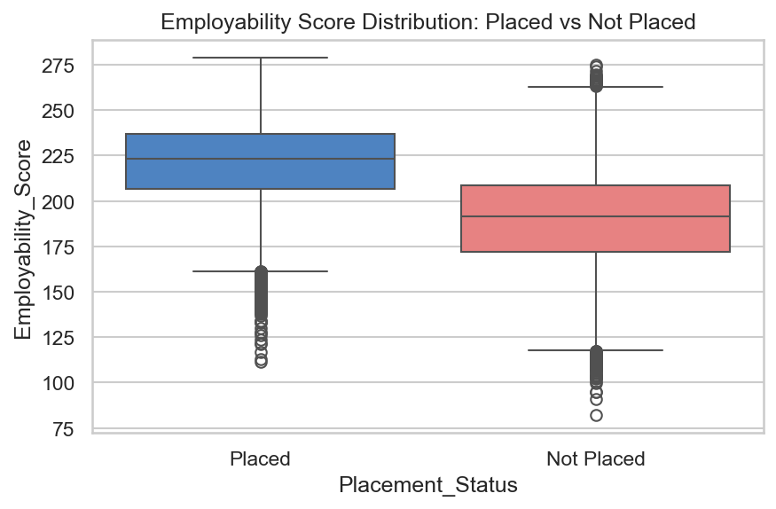

---

### Correlation Heatmap

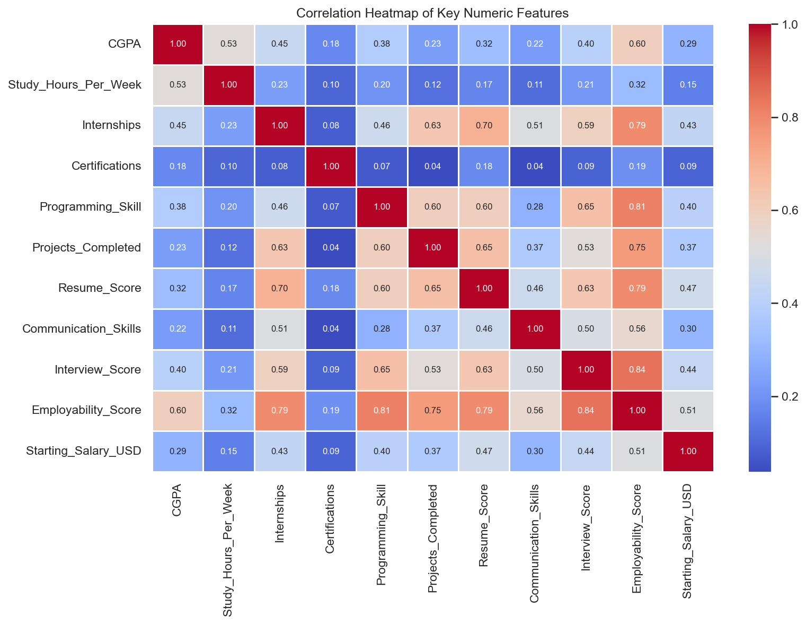

---

### Top Career Fields
Software Engineer (6,544), Data Scientist (3,845), AI Engineer (3,792)

### Most Common Placement Mode
Campus Placement — 19,619 students

---

## Recommendations

1. **Internship support** is the single highest-impact intervention. Placement cells should actively facilitate internship placements, especially for first- and second-year students.
2. Students in lower-placement majors (**Business Analytics**, **Electrical Engineering**) should receive targeted upskilling — guided certification tracks and project mentorship.
3. **GitHub and LinkedIn profile creation** should be encouraged from Year 1, as it correlates with a meaningfully higher placement rate.
4. Career counselors should emphasise **Tier 1 recruitment pathways** given the significant salary gap compared to Tier 2 and Tier 3.
5. **Artificial Intelligence** and **Software Engineering** graduates earn the highest salaries and have the best placement rates — these programmes should be highlighted in career orientation sessions.

---

*Data Analytics Project — PlacementIQ*
